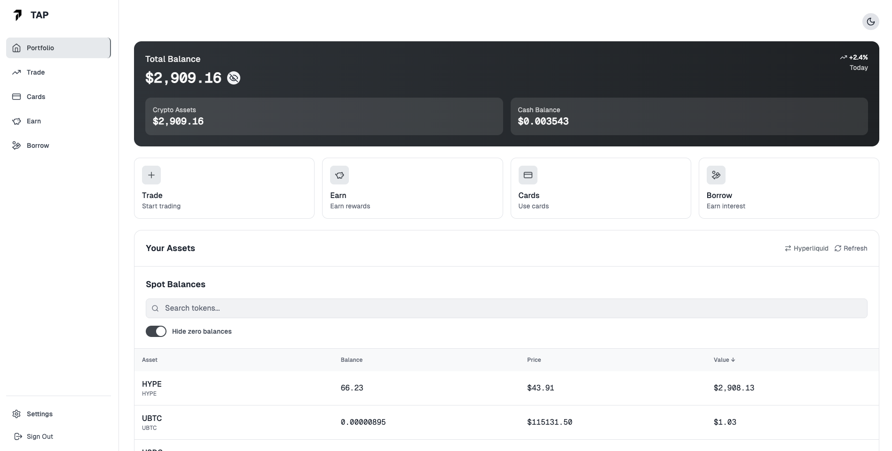

# TAP - Comprehensive Crypto Trading Platform

TAP is a Progressive Web App (PWA) designed to provide a comprehensive cryptocurrency trading experience. This repository contains the compiled frontend assets of the TAP platform.

## Overview

TAP offers a modern, responsive interface for cryptocurrency trading, accessible both on desktop and mobile devices. As a PWA, it can be installed on your device and used offline with cached functionality.

## Screenshot



## Features

- **Progressive Web App**: Install on any device and access offline
- **Responsive Design**: Optimized for both desktop and mobile experiences
- **Crypto Trading**: Comprehensive trading platform for cryptocurrencies
- **Cross-platform**: Works on any device with a modern web browser

## Installation

### Local Deployment

To deploy this compiled application locally:

1. Clone this repository
2. Serve the files using any static web server
   ```bash
   # Example using Node.js http-server
   npx http-server -p 8080
   ```
3. Access the application at `http://localhost:8080`

### Production Deployment

For production deployment, simply upload the contents of this repository to any static web hosting service like:

- Netlify
- Vercel
- GitHub Pages
- AWS S3 + CloudFront
- Firebase Hosting

## PWA Installation

Users can install the TAP application on their devices:

1. Open the website in a compatible browser (Chrome, Edge, Safari, etc.)
2. Look for the "Install" or "Add to Home Screen" option in the browser menu
3. Follow the prompts to install the application

## Project Structure

```
TAP-Frontend/
├── assets/         # Compiled JS, CSS, and other assets
├── icons/          # Application icons in various sizes
├── index.html      # Main HTML entry point
├── manifest.json   # PWA manifest file
└── sw.js           # Service worker for offline functionality
```

## Browser Compatibility

TAP is compatible with all modern browsers including:

- Chrome (and Chromium-based browsers)
- Firefox
- Safari
- Edge

## Development

This repository contains the compiled version of the TAP Frontend. For development purposes, refer to the source repository and build instructions.

## License

[Specify your license information here]

## Contact

[Provide contact information here]
